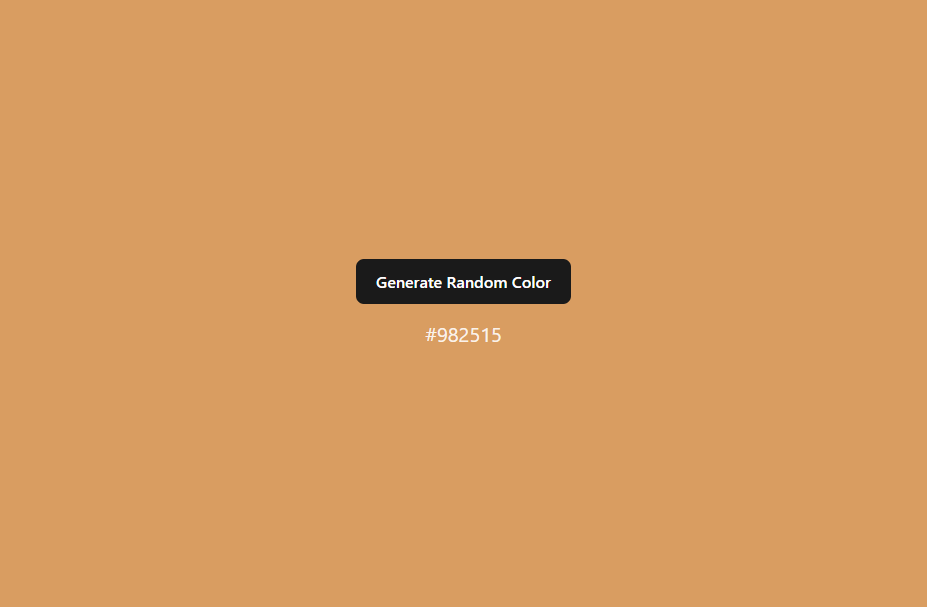
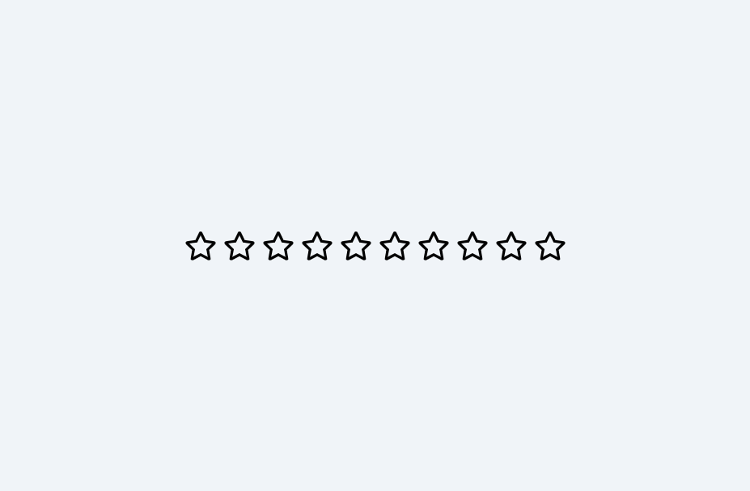
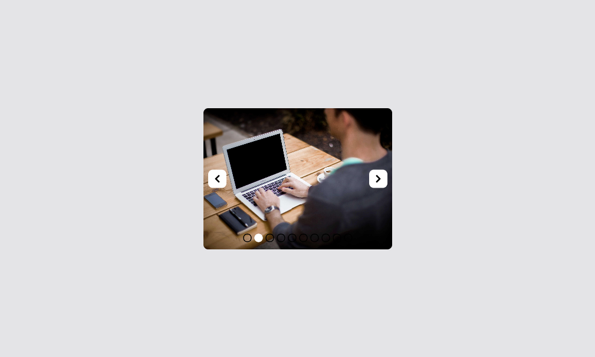
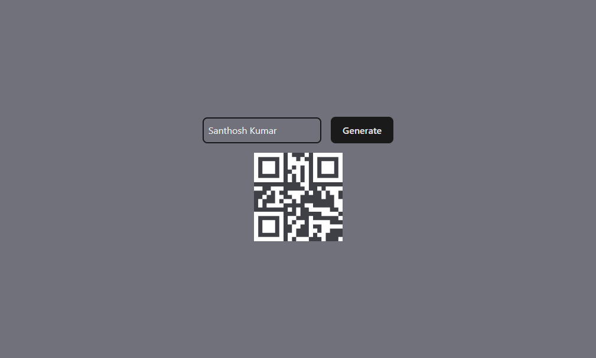
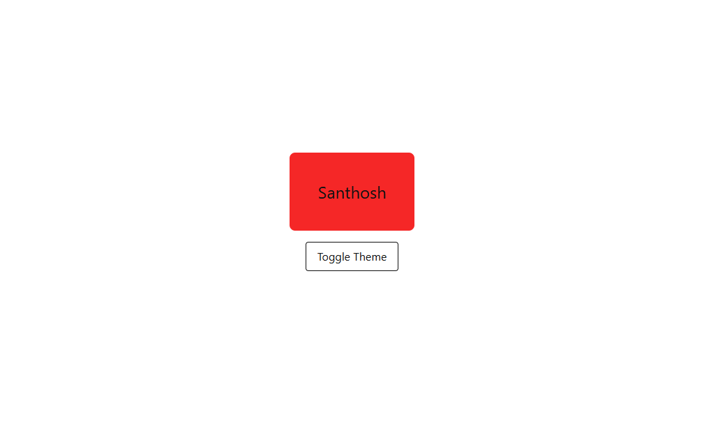
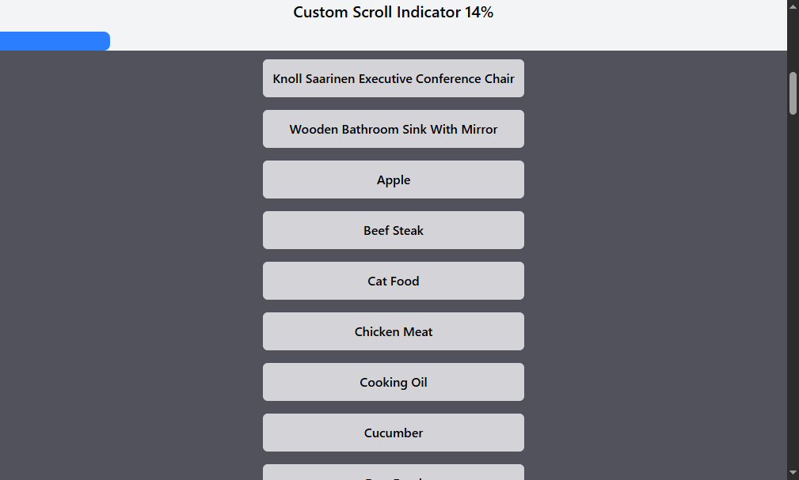
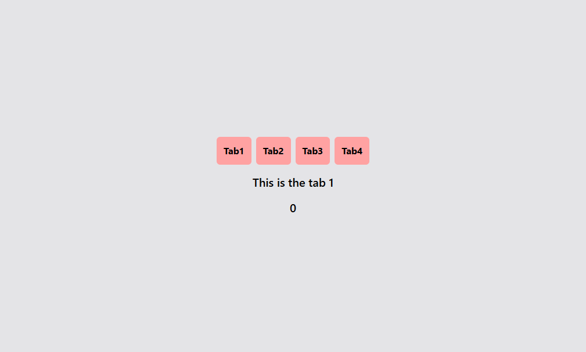

# ⚡ React Realworld Solutions

A collection of **real-world React mini-projects** that solve practical UI and logic challenges developers face every day.
From **accordions and color generators** to **GitHub profile finders** and **Google authentication**, this repo showcases hands-on implementations of popular components and features — all built using **React**.

---

## ✨ Projects Included

🧩 **UI & Interactive Components**

* Accordian
* Image Slider
* Custom Tabs
* Custom Modal Component
* Nested Categories

🎨 **Utility & Fun Projects**

* Random Color Generator
* QR Code Generator
* Dark & Light Mode
* Scroll Indicator
* Load More Feature

🛍️ **E-commerce & Functional Apps**

* Shopping Cart
* Star Rating Ecommerce

🔍 **APIs & Logic-Based Projects**

* GitHub Profile Finder
* AutoSearch
* Google Auth
* Tic-Tac-Toe (Game Logic)

…and many more to come 🚀

---

## 📸 Screenshots

<div align="center">
   &emsp;
   &emsp;
    
  <br/><br/>
   &emsp;
   &emsp;
    
  <br/><br/>
   &emsp;
   &emsp;
    
  <br/><br/>
   &emsp;
   &emsp;
    
  <br/><br/>
   &emsp;
   &emsp;
    
  <br/><br/>
  
</div>

---

## 🚀 Getting Started

Clone this repo and try out each project inside the respective folder.
Each folder contains its own component logic, styles, and screenshot preview.

### 📋 Prerequisites

* Node.js 
* npm 

### ▶️ Run a Project

```bash
cd ProjectName
npm install
npm run dev
```

---

## 🛠️ Tech Stack

* **React** – Component-based UI library
* **Tailwind CSS / CSS Modules** – Styling and responsive design
* **APIs / LocalStorage / Hooks** – For dynamic functionalities

---

## 🔮 Future Additions

* Advanced API-integrated projects
* Form validation examples
* File upload & preview components
* Dashboard templates

---

## 🙋 Author

**Santhosh Kumar P S**

📧 Email: [santhoshkumarsakthi2003@gmail.com](mailto:santhoshkumarsakthi2003@gmail.com)
💻 GitHub: [SanthoshKumar-PS]([https://github.com/Santhosh](https://github.com/Santhosh)
